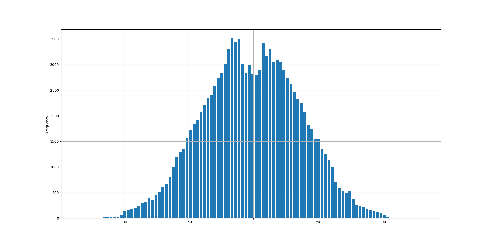

# Deecamp-Dataset-Analysis
summrize the feature of the  Deecamp Dataset

this repository is the analysis of the database and I plot the histogram of each class

run command:

```
python valdata_analysis.py
python traindata_analysis.py
```

and one example of the 'num_points' the 'Car' class in train set is shown in the following:

