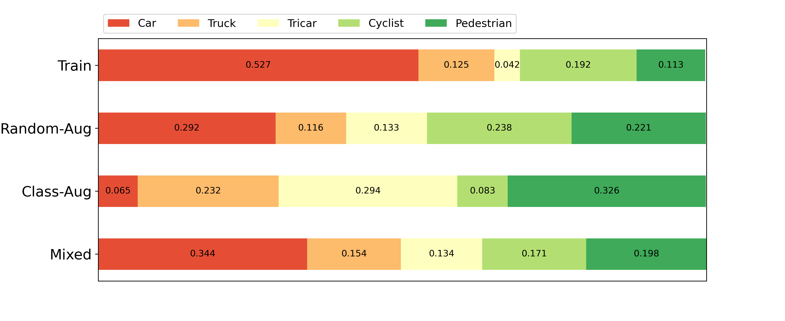
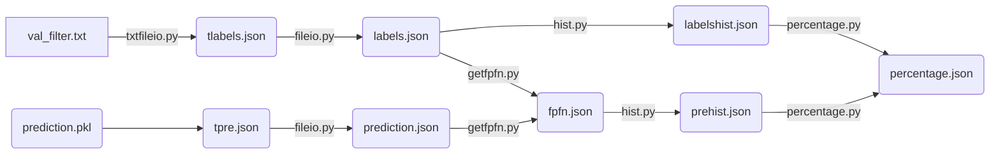
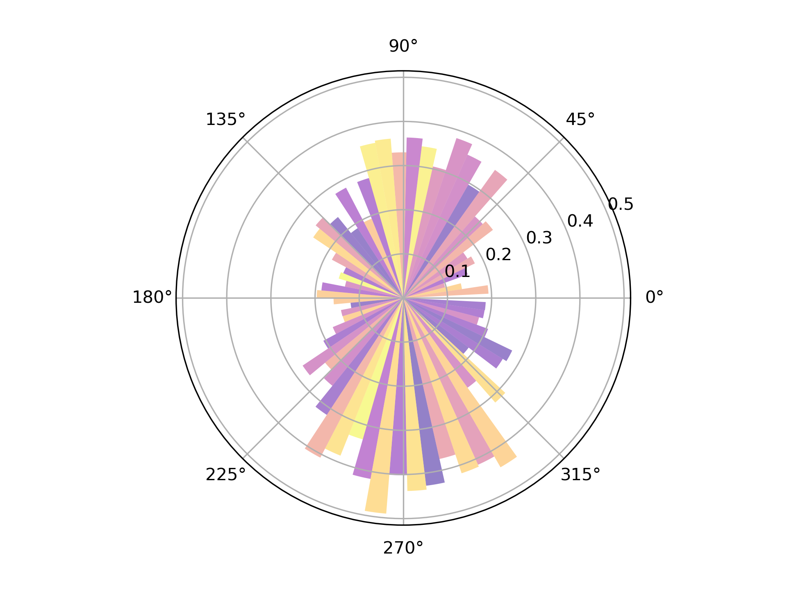
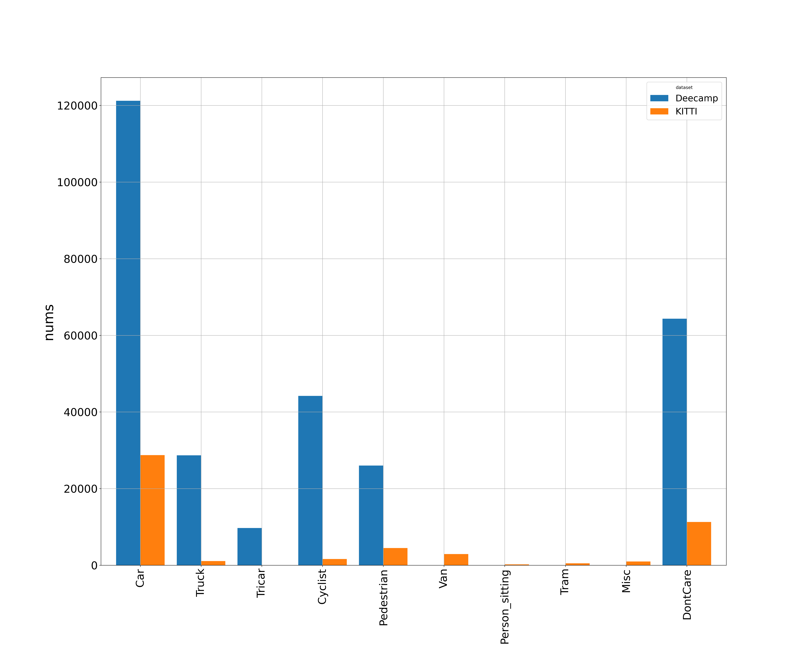

# Deecamp-Dataset-Analysis
summrize the feature of the  Deecamp Dataset

this repository is about the data analysis of Deecamp Dataset and KITTI Dataset.

the related files are in  [Deecamp-KITTI-Dataset-Analysis](https://rec.ustc.edu.cn/share/b7e41ad0-d009-11ea-9cdd-11e74a808133)

## 1 preprocess

File Tree:

```
├── csv
│   ├── Car.csv
│   ├── Car_describe.csv
│   ├── ......
├── data_pre_analysis.py
├── object_nums
│   ├── object_nums.png
│   └── val_object_nums.csv
├── plot
│   ├── Car
│   │   ├── Car_h.png
│   │   ├── ......
│   ├── Cyclist
│   ├── DontCare
│   ├── Pedestrian
│   ├── Tricar
│   └── Truck
├── data_pre_analysis.py
└── need_to_process.txt

```

Quick Start:

```
python data_pre_analysis.py
```

Demo, the comparison of different types of Deecamp Dataset:



## 2 postprocess

File stream :



from `percentage.json` analyze data and plot

Quick Start:

```
python plot.py
```

Demo, the relationship between directions to LiDAR and Miss Rate of 'Car':



## 3 kitti process

process kitti trainset

Quick Start: 

```
python kitti_analysis.py
```

Demo, the comparison of KITTI Dateset and Deecamp Dataset:



